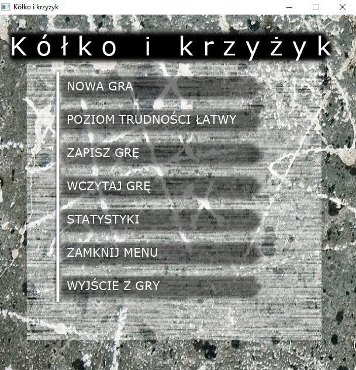
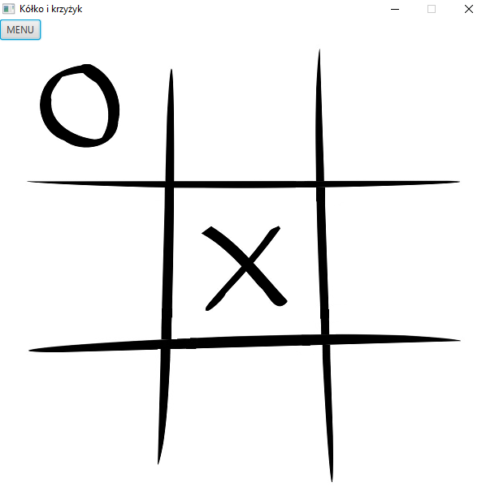
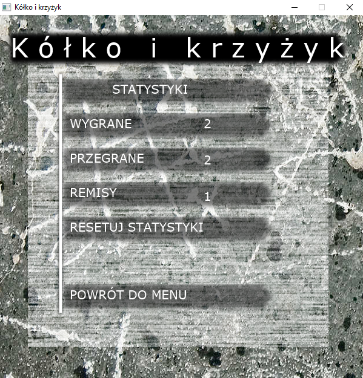

# Tic-Tac-Toe
#### JavaFX game player vs. computer

### Description
Tic-Tac-Toe is a desktop game created in JavaFX. Project created in Java 8 and with gradle 6.1.1. 
Game is in polish language.

### Menu 
##### NEW GAME
`NOWA GRA` - new game, click on it to start new game. Then you can click on desired field to put 'x'

Button `MENU` in left top corner allow to go back to main menu.
##### DIFFICULTY LEVEL
`POZIOM TRUDNOSCI LATWY` - difficulty level easy. Click on it to toggle between easy and hard mode. 
    After change difficulty level to hard, you should see `POZIOM TRUDNOSCI TRUDNY` message.
##### SAVE GAME
`ZAPISZ GRE` - save game. Saved actual status of the game and statistics. 
Game is saved in external txt file, so you can load the game even after restart application.
##### LOAD GAME
`WCZYTAJ GRE` - load saved game.
##### STATISTICS
`STATYSTYKI` - show statistics, won/lost/draw counters and button to reset counters.

Translations of fields:

`STATYSTYKI` - STATISTICS

`WYGRANE` - WON games

`PRZEGRANE` - LOST games

`REMISY` - DRAW games

`RESETUJ STATYSTYKI` - RESET stats

`POWROT DO MENU` - back to main menu

##### CLOSE MENU
`ZAMKNIJ MENU` - click to close menu and back to the game.
##### EXIT APP
`WYJSCIE Z GRY` - click to close application.

### Computer AI
In easy mode game, there is no AI used. Computer choose first free field to put 'o'.

In hard mode, Computer use MiniMax algorithm and calculate the worst scenario of loosing game. 
In this mode there is not possible to win with Computer (lost or draw possible).
